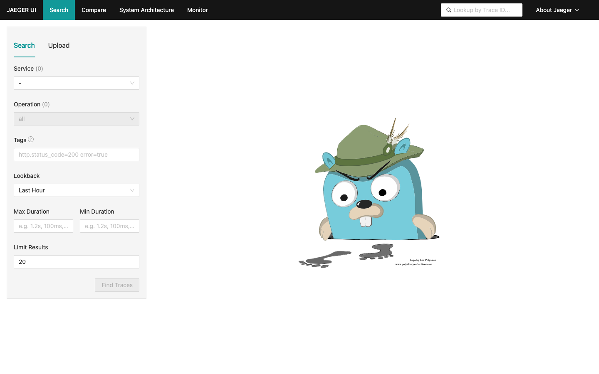

Nexlayer.com
#74 https://github.com/armondhonore/jaeger

LIVE URL: https://relaxed-weasel-jaeger.cloud.nexlayer.ai

See exactly where your microservices spend their time. Jaeger is end-to-end distributed tracing — follow a request across every service and find the slow span. The all-in-one image runs the whole stack in a single pod.

#250apps #nexlayer #observability #tracing #opensource

